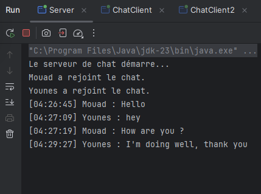
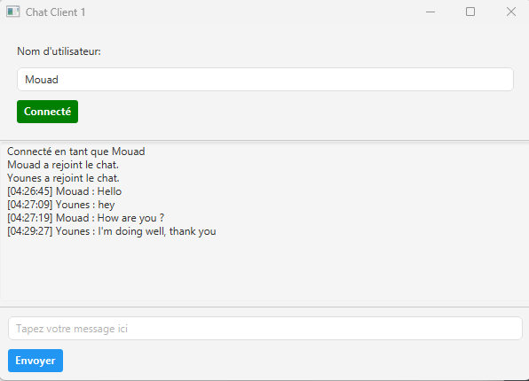
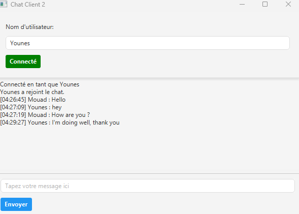

# Application de Chat

Une application de chat simple en JavaFX avec un serveur central et deux clients. 
L'utilisateur doit entrer un nom pour se connecter avant d'envoyer des messages. 
Le serveur relaie les messages entre les clients et affiche la conversation dans son terminal.

## Fonctionnalités

- **Serveur Central** : Écoute sur le port 12345 et relaie les messages entre les clients.
- **Client 1 & Client 2** : Chaque client dispose de sa propre interface où l'utilisateur 
entre un nom d'utilisateur pour se connecter et peut envoyer/recevoir des messages.
- **Étapes de Connexion** : L'utilisateur doit entrer son nom pour se connecter. 
Une fois connecté, les messages sont envoyés via le serveur et affichés dans les interfaces des clients.

## Démarrer l'application

### Prérequis

- JDK Java 11 ou version ultérieure
- JavaFX (version 17.0.6 utilisée dans ce projet)
- Un IDE comme IntelliJ IDEA ou Eclipse (optionnel)

### Structure du Projet

```
Application chat/
└── src/
    └── main/
        ├── java/
        │   ├── server/
        │   │   └── ChatServer.java
        │   ├── client/
        │   │   ├── ChatController.java
        │   │   └── ChatClient.java
        │   └── client2/
        │       ├── ChatController2.java
        │       └── ChatClient2.java
        └── resources/
            ├── client/
            │   └── ChatView.fxml
            └── client2/
                └── ChatView2.fxml
```


### Exécution de l'application

1. **Démarrer le Serveur** :
    - Exécutez la classe `ChatServer.java` dans le package `server`.
    - Le serveur est lancé et se met à l'écoute sur le port 12345, 
   montrant tous les messages directement dans le terminal.

2. **Démarrer le Client 1** :
    - Exécutez la classe `ChatClient.java` dans le package `client`.
    - Dans l'interface utilisateur, entrez votre nom d'utilisateur et cliquez sur **Connexion**.
    - Une fois connecté, vous pouvez taper et envoyer des messages.

3. **Démarrer le Client 2** :
    - Exécutez la classe `ChatClient2.java` dans le package `client2`.
    - Aussi, saisissez un nom d'utilisateur et appuyez sur **Connexion**.
    - Les messages envoyés par l'un ou l'autre des clients sont relayés par le serveur 
   et affichés dans les deux interfaces.

## Captures d'écran

### Terminal du Serveur


### Interface Client 1


*L'utilisateur entre son nom et se connecte. Les messages sont affichés au fur et à mesure de leur réception depuis le serveur.*

### Interface Client 2


*L'utilisateur entre son nom et se connecte. Les messages sont affichés au fur et à mesure de leur réception depuis le serveur.*

## Flux de Connexion

1. **Entrez le Nom d'Utilisateur** : L'utilisateur tape son nom dans le champ de texte prévu à cet effet.
2. **Cliquez sur "Connexion"** : L'application se connecte au serveur en utilisant le nom d'utilisateur fourni.
3. **Envoyer un Message** : Une fois connecté, l'utilisateur peut envoyer des messages. 
Le serveur formate le message avec un horodatage et le relaie à tous les clients connectés.
4. **Afficher la Conversation** : Tous les clients affichent la conversation telle qu'elle est reçue du serveur
et le serveur imprime également la conversation dans son terminal.


